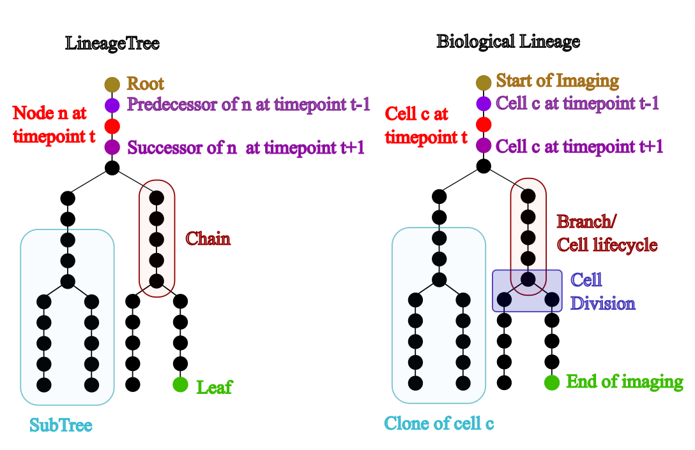

This tool may interest individuals with and without a background in computer science, so all users need to become familiar with the nomenclature used by LineageTree. To that end, this glossary defines the terms used throughout the project.

---

## Tree Graphs
 A tree graph is a hierarchical acyclic graph that contains nodes and edges, **LineageTree is a tree graph** that has at most 2 successors for one node. To create a demo tree the user can call
 
```python
from lineagetree import LineageTree
lT = LineageTree(successors= {i:[i+1] for i in range(10)})
```
<!-- 
 
> The differences between a biological lineage and a LineageTree.

- ### Nodes
 The **smallest part of a LineageTree**, a point that may or may not connect to others. The set of all the nodes may be accessed by ```lT.nodes```

- ### Edges
 The object that **connects 2 nodes**, in the case of the tree its also directed (goes one way). The edges may be accessed through ```lT.edges```

- ### Successors
 The successor of a **node n in timepoint t is the node n' in timepoint t+1** and is connected to the node n. The immutable dictionary (MappingProxy) of all the successors may be accessed by ```lT.successor```

- ### Predecessors
 The predecessor of a **node n in timepoint t is the node n' in timepoint t-1** and is connected to the node n. The immutable dictionary (MappingProxy) of all the predecessors may be accessed by ```lT.predecessor```

- ### Roots
 The root of a tree is **a node that has no predecessors**. In the case of lineageTree the root has an empty tuple as predecessor. LineageTree allows for many roots to exist in the same file. The set of roots may be accessed by using ```lT.roots```

- ### Leaves
 The leaf of a tree is **a node that has no successors**. In the case of lineageTree the leaf has an empty tuple as a successor. The set of leaves may be accessed through ```lT.leaves```

- ### Chains
 A **tree segment**, where **all nodes are between a division or root and a division or a leaf**. To access a chain that contains a specific node `n`, the user may use:``` lT.get_chain_of_node(n) ```
 A continuous subset of a chain may be referred to as a subchain or a path, which is not a chain.

- ### Divisions
 An event where **one node has 2 successors** instead of one. There is no direct way to access a division; however, the node that is before a division (or after) is always at the end or start of a chain (except for the cases that the chain contains a leaf or a root)

- ### Subtree
 Any segment of a tree that is also a tree. The function ```lT.get_sub_tree(node)``` will return a list of all the nodes contained inside the subtree.

- ### Siblings
 **Two nodes that have the same predecessor**. Often used for chains where the first node of each chain has the same predecessor as the other one.

- ### Time
 The time point at which the nodes exist. This property concerns time points and is not real time.
 The immutable dictionary (MappingProxy) containing the time information for all the nodes may be accessed through ```lT.times```.

- ### Time resolution
 How long one time point lasts, relevant only for comparisons across lineages. This attribute can be a property or inspected by ```lT.time_resolution```.
 
 --> 

<div class="split-container">
  <div >

<ul>

  <li>
    <p><strong>Nodes:</strong> The smallest part of a LineageTree, representing a point (usually a cell at a timepoint). All nodes can be accessed with <code>lT.nodes</code>.</p>
  </li>

  <li>
    <p><strong>Edges:</strong> Objects that connect two nodes. In a lineage tree the edges are directed. All edges can be accessed with <code>lT.edges</code>.</p>
  </li>

  <li>
    <p><strong>Successors:</strong> The successor of a node n at time t is the node n' at time t+1 that connects from n. The mapping of all successors can be accessed with <code>lT.successor</code>.</p>
  </li>

  <li>
    <p><strong>Predecessors:</strong> The predecessor of a node n at time t is the node n' at time t−1 that connects into n. The mapping of all predecessors can be accessed with <code>lT.predecessor</code>.</p>
  </li>

  <li>
    <p><strong>Roots:</strong> A node with no predecessors. In LineageTree, a root has an empty tuple as predecessor. Multiple roots may exist. All roots can be accessed with <code>lT.roots</code>.</p>
  </li>

  <li>
    <p><strong>Leaves:</strong> A node with no successors. In LineageTree, a leaf has an empty tuple as successor. All leaves can be accessed with <code>lT.leaves</code>.</p>
  </li>

  <li>
    <p><strong>Chains:</strong> A tree segment where all nodes lie between a root or division and a division or leaf. The chain containing node <code>n</code> can be accessed with <code>lT.get_chain_of_node(n)</code>. A continuous part of a chain is a subchain or path.</p>
  </li>

  <li>
    <p><strong>Divisions:</strong> Events where one node has two successors instead of one. Divisions are inferred because the node before a division is at the end of a chain.</p>
  </li>

  <li>
    <p><strong>Subtree:</strong> Any tree segment that is itself a tree. The subtree rooted at a given node can be retrieved with <code>lT.get_sub_tree(node)</code>.</p>
  </li>

  <li>
    <p><strong>Siblings:</strong> Two nodes that share the same predecessor. Often refers to the first nodes of chains originating from the same division.</p>
  </li>

  <li>
    <p><strong>Time:</strong> The discrete timepoint at which nodes exist (not real time). All node → time information can be accessed with <code>lT.times</code>.</p>
  </li>

  <li>
    <p><strong>Time resolution:</strong> The duration represented by one timepoint. Useful for comparing different lineages. This value can be accessed via <code>lT.time_resolution</code>.</p>
  </li>

</ul>


  </div>
  <div class="fixed-right">
     
  </div>
</div>