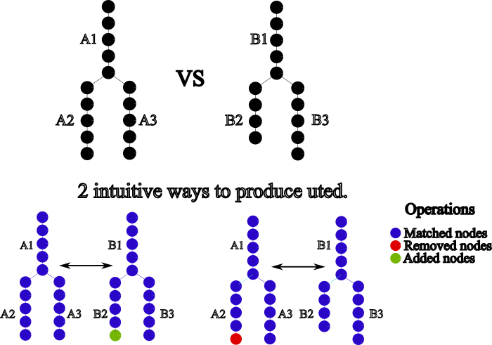
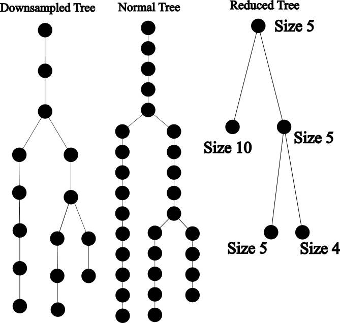
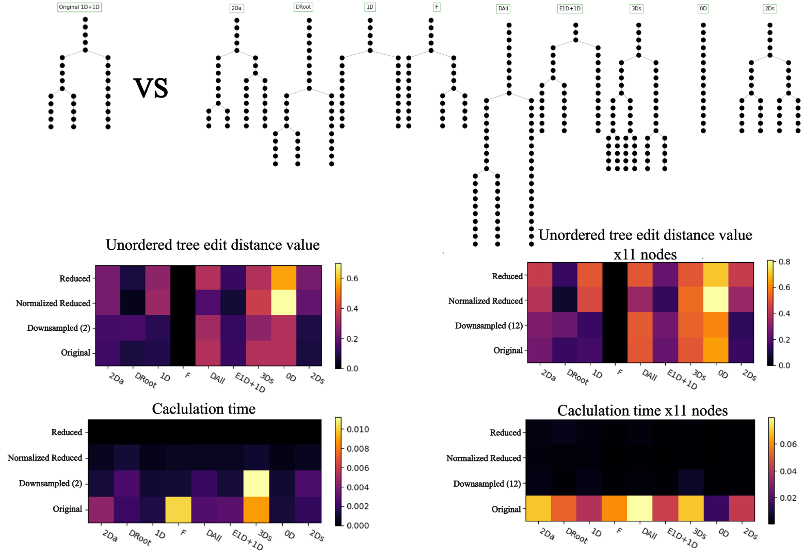
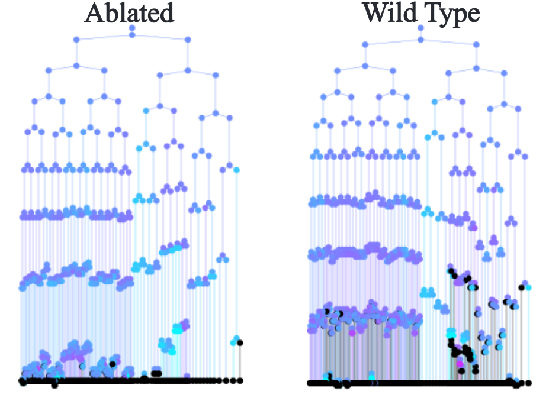

# Introduction to Unordered Tree Edit Distance (UTED)

While visual inspection allows for identifying similar and different lineages, it is insufficient for quantific scientific analysis. Therefore, mathematical tools are required to objectively analyze and compare such structures. This module focuses on finding such patterns across lineages using an unordered tree edit distance (UTED) algorithm developed by [Zhang and Shasha, 1989](https://www.researchgate.net/publication/220618233_Simple_Fast_Algorithms_for_the_Editing_Distance_Between_Trees_and_Related_Problems). UTED computes the minimum number of operations to transform one tree into the other, regardless of labels. In simpler words, how many nodes do we have to add or remove to transform one tree so that it looks identical to the other one (regardless of labels). Apart from adding and removing nodes the algorithm may also substitute nodes, with **any** cost defined by the user. The fact the algorithm can substitute nodes without any cost means that this algorithm is capable of only checking the topology of the 2 trees, from now substituting for cost of zero will be called **matching**. Summarizing there are 3 operations that will be used for transforming trees:

- **Adding nodes**: The same cost as removing
- **Removing nodes**: The same cost as adding nodes
- **Substituting/Matching nodes**: Costs less than adding/removing the nodes being compared.

Adding, Removing and Matching/Substituting always respect hierarchy. If a node `n1` is matched to a node `n2` the `descendants of n1` will **only** be matched with `descendants of n2`.

---

## Why UTED?

There are multiple algorithms that specialize in comparing tree graphs, like the ones used in phylogeny research. All these algorithms, have one feature in common, they require the label of the node, thus instead of transforming one tree to the other in terms of topology they aim to create the exact copy of the other tree, including the labels. These algorithms would find great use in organisms like ***C. Elegans*** where all of their lineages have been thoroughly studied and labelled. Other specimens may not have such a simplistic and well defined development so it is impossible to label them correctly.

UTED is label agnostic, meaning it can compare lineages without needing any prior knowledge of the naming of the cell, however this strength comes with a significant drawback: the algorithm must map nodes from one tree to another which makes time consumed scale exponentially to the number of nodes, because there are many possible mappings. This pairing always respects the hierarchical structure of the trees, thus the descendants of a node ```n``` that has been mapped to a specific node ```n``` of the other tree, will not be mapped to nodes of the ancestors of ```n'```



---

## Different Tree approximations - making UTED faster

There are multiple ways to match 2 random trees that have more than 2 nodes, but the algorithm will try to find the **best** matching, the one that will need the least amount of operations to transform one tree into the other. Of course this proccess of checking multiple matchings needs computational power and time. To solve this problem, we developed some approximations to make computation more efficient.

1. **Original Tree**: This algorithm is the simplest, as the dataset is used without changes to produce the distance. So the algorithm will either:

    - **Match** a node, where the cost will be 0
    - **Add/Remove** a node to/from a tree, costing 1.

    Normal tree is the most accurate, but it does not scale well with big datasets, meaning that computation time scales exponentially with the number of nodes.

2. **Downsampled Tree**: This algorithm reconstructs the tree but skips nodes every n time points, so the result will be similar to the first tree but with less accuracy. In other words, it simulates the same dataset with bigger time resolution, meaning less points.

    - **Match** a node, where the cost will be 0
    - **Add/Remove** a node to/from a tree, costing 1.

    Downsampled Tree is slightly less accurate or equal (according to the downsampling rate) to normal tree, but much faster.

3. **Reduced Tree**: This algorithm will reconstruct the trees, but every chain will be replaced with a node of a length attribute that will have the same value as the chains length. Meaning that the number of nodes in the new trees will be equal to the number of chains in the original lineage.This approximation completely changes the behaviour of the algorithm, as it will match whole chains with other chains and not just nodes. Such an algorithm may be extremely useful for fast but not precise results, however some biological question may be better answered using this algorithm.

    - **Substitute** a node, the cost will be the absolute difference of the length of the 2 chains
    - **Add/Remove** a node, will add/remove a node of size equal to the length of the existing chain, so the cost will be the value of the length of the chain.

    This algorithm is extremely lightweight and fast; however, the score is different than the normal tree. Some users may prefer this algorithm due to its capability of comparing chains instead of nodes, making it easily interpretable. Many other developers use the same or similar algorithms to this one [Natesan et al, 2024](https://journals.plos.org/ploscompbiol/article?id=10.1371/journal.pcbi.1011733)

4. **Bound Reduced Tree**: This algorithm will use the same tree as the reduced tree, however the edit operations are modified so that big chains that have similar length will be easier to be matched together. Has the strengths of reduced tree, but the resulting distance is closer to the that of the normal tree.


    - **Match** a node, the cost will be the absolute difference of the length of the 2 chains divided by the sum of both of them, so the result will be between 0 and 1
    - **Add** a node, will add a node of size 1
    - **Remove** a node, will remove a node of size 1

    This algorithm has all the advantages of reduced tree, but tries to reduce its disadvantages but adding a new way of comparing chains.



To inspect any style:

```python
from LineageTree import tree_styles
tree_styles.tree_style["simple"].value(parameters)
```

---

## The need for normalization - Making UTED interpretable

UTED is great to measure distance between 2 tree graphs, but the resulting distances range from zero to infinity, meaning that the results are not directly interpretable. Having this in mind two large trees that look similar may have a bigger distance than two relatively small, but very disimilar trees.

Thus, to overcome these limitations and convert them to a similarity measure we implemented 2 normalization algorithms:

- **Sum**: The maximum distance between 2 random trees is the cost to convert one tree to null and then create the other tree from null.
- **Max**: The result distance is divided by the cost to create the largest of the 2 trees from scratch, this algorithm primarily produces results in the range of 0 and 1, but sometimes for very disimilar trees the result may be greater than 1.

Template to create new styles:

```python
from LineageTree import lineageTree
from LineageTree.tree_styles import abstract_trees

class tree_style_template(abstract_trees):

   ### The user has to implement these methods

   def get_tree(self)-> tuple[dict[int, list], dict[int, int | float]]:
       out_dict = {}
       times_or_other_attribute = {}
       ... # If time_scale exists for cross embryo comparison use it here
       return (out_dict, # The hierarchy of the nodes should be a dict(unique_node:[successors])
               times_or_other_attribute) # An attribute that may be used for comparisons.
  
   def _edist_format(self, adj_dict): # This methods seldom needs changing, creates the adjacency matrix 
       return super()._edist_format(adj_dict)# and provides the corresponding nodes that between lt and the tree style
  
   def delta(self, x, y, corres1, corres2, times1, times2)-> int|float:
       if x is None and y is None:
           return 0
       if x is None: # Cost for removing a node
           return times2[corres2[y]]
       if y is None: # Cost for adding a node
           return times1[corres1[x]]
       len_x = times1[corres1[x]]
       len_y = times2[corres2[y]]
       return abs(len_x - len_y) # Cost for matching a node
  
   def get_norm(self)->int|float:
       ... # how will the normalization work, should return a function that
       ... # calculates the norm for every subtree of the starting tree
       return value
  
   @staticmethod
   def handle_resolutions(
       time_resolution1: float | int,
       time_resolution2: float | int,
       gcd, #the greatest common divisor of all the time resolutions of datasets in the manager.
       downsample: int,
   ) -> tuple[int | float, int | float]: #Needed for cross embryo analysis
       ...
       return (time_resolution_fix_for_dataset_1   # This list will be used as the time scale
               ,time_resolution_fix_for_dataset_2) # parameter when comparing.
```

## Testing the approximations

This section is focused on showcasing the advantages and disadvantages of the tree approximations shown in the previous section. 



This plot showcases several interesting aspects of the approximations:

1. All of the approximations scale well, as they produce the same results for the same trees regardless of the length of the chains.

2. The Original tree is very slow compared to the rest and the downsampled algorithm shines for bigger trees, as it proves to be extremely fast while being acuurate.
3. It is easy to see where each approximation succeeds or fails, if we consider that comparing the original distances is the best result we can get. Downsampled tree, will almost always have the closes result to the origial tree. Considering DAll, normalized reduced tree performs very well for datasets with different time resolution.

All in all, the downsampled tree is the best approximation to use for distance calculation. However, the **reduced** type algorithms match chains instead of nodes, meaning that in developmental biology terms, that it matches cell lifetimes together, which may prove an invaluable tool for developmental biology. All of the approximations have a use, so the user should select the appropriate one according to the specifics of the problem.


## Using the Matching Component of UTED

UTED calculates distances between two tree graphs by matching their nodes. Extracting the matched nodes provides important information, particularly for labeled datasets. For example, when calculating the distance between two embryos, we can identify which clone or sublineage in one embryo corresponds to a clone or sublineage in the other. To support this, UTED includes functions specifically designed to find the matching between two lineages.

### Tree distance Graphs

The distance value is a useful metric for quantifying the similarity between two lineages, but it does not provide detailed information about, where the similarities and disimilarities occur within the trees. To address this, we developed tree distance graphs by leveraging the matched pairs produced during the mapping process.

In these graphs, each matched chain is colored according to the value of its subtree, providing a visual representation of mapping quality. Tree distance graphs reveal two important aspects:

- Variance: The color spectrum highlights the distances of mapped chains. Colors representing good mappings indicate low variance during development.
- Gain or Loss of Function: Unmapped regions indicate lineages that exist in one tree but not the other. This may reflect biological differences, such as the emergence or loss of a lineage, or it may point to data quality issues.




## API reference

### ::: lineagetree.measure
        options:
            filters:
                - "^unordered_tree_edit_distance$"
                - "^unordered_tree_edit_distances_at_time_t$"
                - "^clear_comparisons$"
                - "^plot_tree_distance_graphs$"
                - "^labelled_mappings$"

