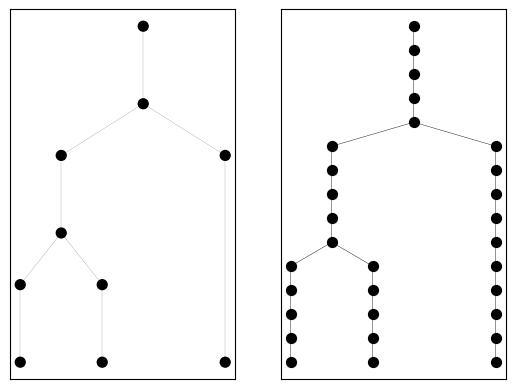

Visualising lineages:

Usually, tracked lineages contain hundreds of thousands of nodes, thus calculating each position for the nodes of the tree graph is time-consuming. To solve this problem, we decided to use a model that reduces the number of nodes to a minimum. In this model, we would use the start and end of each chain, while the length of the chain would correspond to the time distance between the two nodes, as shown in the next image.

This way, the whole lineage can be plotted efficiently, even if the second graph is more representative of the truth.

